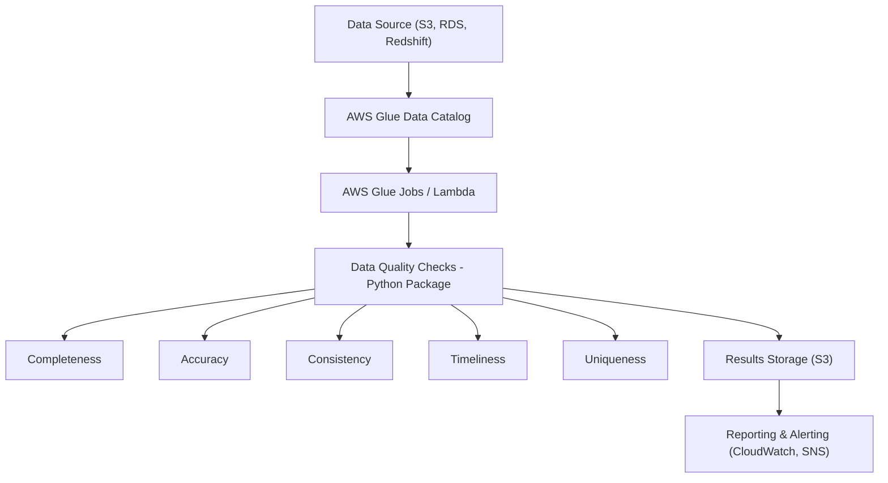

# 🛠️ Data Quality Framework on AWS

## 🚀 Overview
This is a configurable and scalable **Data Quality Framework (DQF)** built for AWS Cloud. It enables teams across the organization to integrate automated data quality checks into their workflows using either a Python package or CloudFormation-based deployment.

---

## 🔑 Features
- Modular data quality checks:
  - Completeness
  - Accuracy
  - Consistency
  - Timeliness
  - Uniqueness
- AWS-native integration (S3, Glue, Athena, Lambda)
- Deployable as a Python package or AWS CloudFormation template
- Easily extensible for team-specific checks and rules
- Stores results and sends alerts for quality violations

---

## 🏗️ Architecture Diagram



---

## 🔧 Components

### 1. Data Sources
Supports AWS-native storage solutions like:
- Amazon S3
- Amazon RDS
- Amazon Redshift

### 2. AWS Glue Data Catalog
Used to define and access structured metadata for input data.

### 3. AWS Glue Jobs / Lambda
- **Glue Jobs**: For scheduled or batch jobs
- **Lambda Functions**: For lightweight or near real-time checks

### 4. Python DQ Package
Includes built-in modules:
- `completeness_check()`
- `accuracy_check()`
- `consistency_check()`
- `timeliness_check()`
- `uniqueness_check()`

Custom rules can be added via config files (`.yaml` or `.json`).

### 5. Results Storage
All quality reports are stored in:
- Amazon S3 (for audit)
- Optional: DynamoDB for quick lookup

### 6. Reporting and Alerts
- **Amazon CloudWatch**: Logs & metrics
- **Amazon SNS**: Alert notifications on failure or threshold breaches

---

## 📦 Distribution Methods

### Option 1: Python Package

Install via pip:
```bash
pip install data-quality-framework
```

Use in your Glue script:
```python
from dq_framework import run_quality_checks

run_quality_checks(config_path='config.yaml')
```

### Option 2: AWS CloudFormation Template

Deploy DQ infrastructure via IaC:
```yaml
Resources:
  DataQualityFramework:
    Type: AWS::Glue::Job
    Properties:
      Command:
        Name: glueetl
        ScriptLocation: s3://your-bucket/scripts/dq_framework.py
      Role: GlueServiceRole
      DefaultArguments:
        --job-language: python
        --extra-py-files: s3://your-bucket/packages/data_quality_framework.zip
```

---

## ⚙️ Usage Guide

1. Define rules in `config.yaml` or `config.json`:
```yaml
checks:
  - table: customer_data
    completeness:
      columns: ["email", "customer_id"]
    uniqueness:
      columns: ["customer_id"]
```

2. Run Glue Job / Lambda with the configuration.

3. Monitor logs and alerts in CloudWatch and SNS.

---

## ✅ Benefits

- Centralized quality enforcement
- Easy onboarding for new teams
- Reusable across environments
- Fully automated with minimal manual intervention

---

## 📌 Conclusion

This AWS-based Data Quality Framework ensures **enterprise-grade validation**, **continuous monitoring**, and **seamless integration** into your data pipelines. Designed for scale, flexibility, and ease of use.

---

## 📄 License

MIT License
