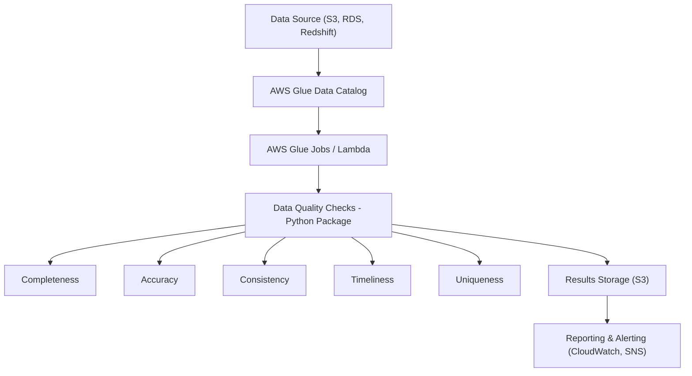

# 🛠️ Data Quality Framework on AWS

## 🚀 Overview
This is a configurable and scalable **Data Quality Framework (DQF)** built for AWS Cloud. It enables teams across the organization to integrate automated data quality checks into their workflows using either a Python package or CloudFormation-based deployment.

---

## 🔑 Features
- Modular data quality checks:
  - Completeness
  - Accuracy
  - Consistency
  - Timeliness
  - Uniqueness
- AWS-native integration (S3, Glue, Athena, Lambda)
- Deployable as a Python package or AWS CloudFormation template
- Easily extensible for team-specific checks and rules
- Stores results and sends alerts for quality violations

---

## 🏗️ Architecture Diagram



---

## 🔧 Components

### 1. Data Sources
Supports AWS-native storage solutions like:
- Amazon S3
- Amazon RDS
- Amazon Redshift

### 2. AWS Glue Data Catalog
Used to define and access structured metadata for input data.

### 3. AWS Glue Jobs / Lambda
- **Glue Jobs**: For scheduled or batch jobs
- **Lambda Functions**: For lightweight or near real-time checks

### 4. Python DQ Package
Includes built-in modules:
- `completeness_check()`
- `accuracy_check()`
- `consistency_check()`
- `timeliness_check()`
- `uniqueness_check()`

Custom rules can be added via config files (`.yaml` or `.json`).

### 5. Results Storage
All quality reports are stored in:
- Amazon S3 (for audit)
- Optional: DynamoDB for quick lookup

### 6. Reporting and Alerts
- **Amazon CloudWatch**: Logs & metrics
- **Amazon SNS**: Alert notifications on failure or threshold breaches

---

## 📦 Distribution Methods

### Option 1: Python Package

Install via pip:
```bash
pip install data-quality-framework
```

Use in your Glue script:
```python
from dq_framework import run_quality_checks

run_quality_checks(config_path='config.yaml')
```

### Option 2: AWS CloudFormation Template

Deploy DQ infrastructure via IaC:
```yaml
Resources:
  DataQualityFramework:
    Type: AWS::Glue::Job
    Properties:
      Command:
        Name: glueetl
        ScriptLocation: s3://your-bucket/scripts/dq_framework.py
      Role: GlueServiceRole
      DefaultArguments:
        --job-language: python
        --extra-py-files: s3://your-bucket/packages/data_quality_framework.zip
```

---

## ⚙️ Usage Guide

1. Define rules in `config.yaml` or `config.json`:
```yaml
checks:
  - table: customer_data
    completeness:
      columns: ["email", "customer_id"]
    uniqueness:
      columns: ["customer_id"]
```

2. Run Glue Job / Lambda with the configuration.

3. Monitor logs and alerts in CloudWatch and SNS.

---

## 📊 Implementation Steps

### 1. Project Structure
```
aws-dq-framework/
├── dq_framework/
│   ├── __init__.py
│   ├── config_loader.py
│   ├── glue_reader.py
│   ├── checks/
│   │   ├── __init__.py
│   │   ├── completeness.py
│   │   ├── accuracy.py
│   │   ├── consistency.py
│   │   ├── timeliness.py
│   │   └── uniqueness.py
│   ├── runner.py
│   └── utils.py
├── examples/
│   └── config.yaml
├── scripts/
│   └── dq_framework_glue_job.py
├── setup.py
└── README.md
```

### 2. Implementation Steps

#### Step 1: Set Up Python Package
- Create virtual environment
- Define dependencies in `setup.py`
- Structure module with pluggable check modules in `checks/`

#### Step 2: Create Config Loader
- `config_loader.py` parses YAML or JSON configurations
- Loads table names, columns, check types, thresholds

#### Step 3: Read Data from Glue
- `glue_reader.py` uses `boto3` or `pyathena` to fetch data via SQL
- Uses Glue Catalog to locate S3 paths or Redshift tables

#### Step 4: Implement Check Modules
Each check module implements a `run_check(dataframe, config)` interface:
- `completeness.py`: Null checks
- `accuracy.py`: Regex or reference data checks
- `consistency.py`: Cross-field logic
- `timeliness.py`: Timestamp freshness
- `uniqueness.py`: Duplicate detection

#### Step 5: Execute and Log Results
- `runner.py` coordinates loading data and applying checks
- Stores results as CSV/JSON in S3
- Sends logs/metrics to CloudWatch
- If thresholds breached → send alerts via SNS

#### Step 6: Package & Distribute
- Zip and upload to S3 for Glue Jobs
- Or publish on PyPI/internal registry

#### Step 7: Automate via Glue or Lambda
- Trigger jobs periodically or on data arrival
- Use EventBridge or CloudWatch Events for scheduling

---

## ✅ Benefits

- Centralized quality enforcement
- Easy onboarding for new teams
- Reusable across environments
- Fully automated with minimal manual intervention

---

## 📌 Conclusion

This AWS-based Data Quality Framework ensures **enterprise-grade validation**, **continuous monitoring**, and **seamless integration** into your data pipelines. Designed for scale, flexibility, and ease of use.

---

## 📄 License

MIT License
